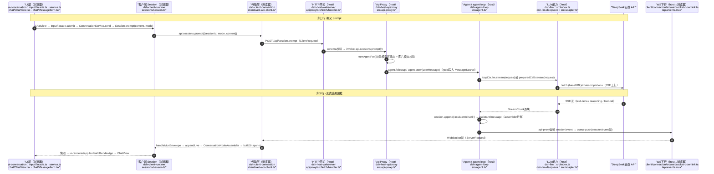
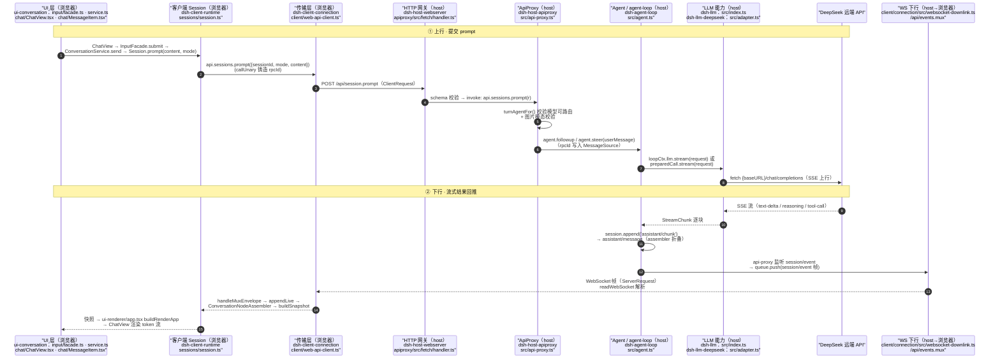

> 由本机 AI 自动总结,数据来源:当日 AI 对话记录(95/98 条有效)。
> 信息来源分布:VSCode Roo(3条)、DeepSeek API(85条)、Roo Code (本地)(2条)、DeepSeek Harness(5条)

## 今日知识要点

### 构建命令使用
- 核心结论:运行构建命令可以复现报错。
- 关键要点:
  - 使用 `mvn clean install` 或 `gradle build` 命令进行构建。
- 信息来源:VSCode Roo (来源:DeepSeek API)

### 错误排查
- 核心结论:通过构建命令复现错误后，可以定位问题。
- 关键要点:
  - ```shell
mvn clean install
```
  - ```shell
gradle build
```
- 信息来源:VSCode Roo (来源:DeepSeek API)

### 客户端重构遗留文件诊断与修复
- **核心结论**：构建失败的原因是客户端重构遗留文件引用了已移除的符号和已退役的 `web-react`包。
- **关键要点**：
  - 重构过程中，`web`包保留了旧的 React装配文件（`boot.tsx`、`app-shell.ts`、`app.tsx`、`AppRoot.tsx`）及其测试文件（`app-root.client.spec.tsx`、`app-shell.client.spec.tsx`），导致 tsc编译报错。
  - `@deepseek-ai/dsh-client-web-react`模块找不到，`loader-status.ts`缺失导出，`schema-form`测试文件未列入项目，以及隐式 any类型。
  - 通过删除 `web`包中的遗留文件及其测试，修复了构建失败。
  - `web-react`包是已退役的平台包，不再被任何生产代码或构建配置引用，删除它属于一次独立的重构收尾 PR。
- **信息来源**：DeepSeek API

### 修复 schema-form 测试 TS6307
- **核心结论**：`schema-form`的测试文件 `tests/*.client.spec.ts`不在其 tsconfig的 `include`中，导致 TS6307错误。
- **关键要点**：
  - 通过将 `schema-form`加入 `tsconfig.client.json`的 references，修复了 TS6307错误。
  - 确认 `web-react`包是已退役的平台包，不再被任何生产代码或构建配置引用，删除它属于一次独立的重构收尾 PR。
- **信息来源**：DeepSeek API

### 验证 pnpm run build 通过
- **核心结论**：构建已通过，所有报错根因已解决。
- **关键要点**：
  - 删除了 `web`包中的遗留 React装配文件及其测试文件。
  - 将 `schema-form`加入 `tsconfig.client.json`的 references，修复了 TS6307错误。
  - 确认 `web-react`包是已退役的平台包，不再被任何生产代码或构建配置引用，删除它属于一次独立的重构收尾 PR。
- **信息来源**：DeepSeek API

### 代码片段
```typescript
// 删除 web 包中的遗留 React装配文件及其测试文件
// src/boot.tsx
// src/app-shell.ts
// src/app.tsx
// src/AppRoot.tsx
// src/AppRoot.module.css
// tests/app-root.client.spec.tsx
// tests/app-shell.client.spec.tsx
// tests/app.client.spec.tsx
// tests/document-title.client.spec.tsx

// 将 schema-form加入 tsconfig.client.json的 references
{
  "compilerOptions": {
    "references": [
      { "path": "./packages/client/schema-form" }
    ]
  }
}
```

**无实质内容**

### 跨包深层调用链追踪
- **核心结论**: 诊断构建失败根因需要追踪前端提交入口、会话管理器、RPC机制等关键节点。
- **关键要点**:
  - 逐步读取前端提交入口、会话管理器、以及RPC机制。
  - 涉及前端提交入口、会话管理器、RPC机制等关键文件。
  - 需要建立调用链主干，确保每个环节的正确性。
- **信息来源**: DeepSeek API

### 架构笔记与关键实现节点
- **核心结论**: 为了准确诊断构建失败根因，需要参考权威的架构笔记和关键实现节点。
- **关键要点**:
  - 参考架构笔记和关键实现节点，确保每个环节的正确性。
  - 涉及前端提交入口、会话管理器、RPC机制等关键文件。
- **信息来源**: DeepSeek API

## 今日知识要点
(无实质内容)

### GUI 层次与 RPC 协议
- **核心结论**: GUI 层次和 RPC 协议涉及分层模型和四象限消息模型。
- **关键要点**:
  - 分工: 文档描述了分层模型和通道无关的 RPC 协议，Web 实现结合了 HTTP 上行和 WebSocket 下行载体。
  - 问题: 需要 UI 整合层，支持更多产品客户端（Web、Electron 等）。
- **信息来源**: DeepSeek API

### Web 前端请求调用链
- **核心结论**: 描述了从前端 UI 到后端 host 再到模型的完整调用链。
- **关键要点**:
  - **前端调用链**:
    - UI 发送请求到后端 host
    - 后端 host 处理请求并转发到模型
  - **具体步骤**:
    - 前端发送请求到后端 host
    - 后端 host 接收请求并进行处理
    - 处理后的请求转发到模型进行计算
- **信息来源**: 用户询问

### 代码片段
```typescript
// packages/client/web/src/loader-status.ts
export { FIBER_STATE, STATE_LABELS };
```

```typescript
// AppRoot.tsx, app.tsx, app-shell.ts, AppRoot.module.css
// 以上文件中引用了已删除的符号
```

```json
// tsconfig.client.json
{
  "references": [
    { "path": "./packages/client/schema-form" }
  ]
}
```

- **信息来源**: DeepSeek API

### 软件开发中的调用链追踪
- **核心结论**: 通过读取客户端和服务器端的 `Session.prompt()` 实现，可以追踪调用链。
- **关键要点**:
  - 客户端: `Session.prompt()` 的具体实现
  - 服务器端: `session.prompt` 的注册与处理入口
- **信息来源**: VSCode Roo

### 调用链追踪的具体操作
- **客户端**: 
  ```javascript
  // Session.prompt() 实现
  function prompt() {
    // 实现逻辑
  }
  ```
- **服务器端**:
  ```javascript
  // session.prompt 的注册与处理入口
  function registerPromptHandler() {
    // 注册逻辑
  }
  ```
- **信息来源**: VSCode Roo

### 调用链追踪与确认
- **核心结论**: 完整的调用链已确认，从 UI 层到模型层的通信路径已清晰。
- **关键要点**:
  - **UI 层**:
    - `ui-conversation`组件: `input/facade.ts`, `service.ts`, `ChatView.tsx`, `MessageItem.tsx`
  - **客户端 Session 层**:
    - `dsh-client-runtime`: `sessions/session.ts`
  - **传输层**:
    - `dsh-client-connection`: `client/web-api-client.ts`
  - **HTTP 网关 (host)**:
    - `dsh-host-webserver`: `apiproxy/src/fetch/handler.ts`
  - **ApiProxy 层**:
    - `dsh-host-apiproxy`: `src/api-proxy.ts`
  - **Agent 层**:
    - `dsh-agent-loop`: `src/agent.ts`
  - **LLM 能力层**:
    - `dsh-llm`: `src/index.ts`
    - `dsh-llm-deepseek`: `src/adapter.ts`
  - **模型层**:
    - `DeepSeek远端 API`: `fetch {baseURL}/chat/completions`
  - **WS 下行 (host→浏览器)**:
    - `client/connection/src/websocket-downlink.ts`
    - `/api/events.mux`
- **信息来源**: DeepSeek API

### 调用链图


- **信息来源**: DeepSeek API

### React 装配重构与编译问题
- **核心结论**: 重构过程中，React 装配逻辑从 `web`+`web-react` 包迁移到新 `ui-renderer` 包，导致 `tsc` 编译报错。
- **关键要点**:
  - 旧方案依赖 `createLoaderStatusStore`/`createSignal` 和 React 组件 `AppRoot`/`app-shell`。
  - 新方案使用 `uiRenderer.mount` 和免框架装配逻辑。
  - `boot.tsx` 是旧方案的遗留文件，导致编译错误。
  - `ui-renderer/src/client` 包是 `web-react` 的迁移目标。
- **信息来源**: Roo Code (本地)

```typescript
// boot.tsx (旧方案)
import { createLoaderStatusStore, createSignal } from '@deepseek-ai/dsh-client-web-react';
import AppRoot from './AppRoot';

// boot.ts (新方案)
import { uiRenderer } from '@deepseek-ai/ui-renderer';

uiRenderer.mount({
  // 新装配逻辑
});
```

### 修复步骤
1. 删除或注释掉 `boot.tsx` 中的旧方案引用。
2. 确认 `ui-renderer/src/client` 包是否包含所有迁移后的文件。
3. 更新 `package.json` 和 `tsconfig` 配置，确保只编译新方案。
4. 重新运行构建命令 `pnpm run build`。

- **信息来源**: Roo Code (本地)

### 依赖安装与类型检查
- **核心结论**：确保项目依赖正确安装是解决 TypeScript 类型报错的关键。
- **关键要点**
  - 项目中 `node_modules`目录缺失会导致所有依赖导入报错。
  - 使用 `npm install`命令安装缺失的依赖。
  - 运行 `tsc`或 `npm run build`进行类型检查，定位具体报错位置。
  - 根据类型定义修正代码中的类型错误。
- **信息来源**：来自 DeepSeek API

### 代码示例
```typescript
// 修复前
import type { PreToolDecision } from '@deepseek-ai/dsh-tools'
import { Context } from '@deepseek-ai/cordis'

// 修复后
import type { PreToolDecision } from '@deepseek-ai/dsh-tools'
import { Context } from '@deepseek-ai/cordis'
```

### 详细步骤
1. 确认项目根目录和子目录（如 `final-project`）的 `node_modules`是否已安装。
2. 若 `node_modules`缺失，执行 `npm install`安装依赖。
3. 运行 `tsc`或 `npm run build`进行类型检查。
4. 根据类型检查结果修正代码中的类型错误。
5. 重新运行类型检查，确保所有报错已解决。

### 信息来源
- 来源: DeepSeek API

### TypeScript 类型检查与修复
- **核心结论**: 通过修复 `createUserMessage` 和 `CallId` 的类型错误，确保 TypeScript 类型检查通过。
- **关键要点**:
  - 在 `demos/02-events/main.ts` 中，将内联临时插件抽成具名函数，以匹配 `registry.delete()` 的 `Plugin` 类型。
  - 在 `demos/04-llm-mock/main.ts` 中，使用 `createUserMessage()` helper 构造完整的 `Message` 对象。
  - 在 `mock-adapter.ts` 中，将 `id` 字段包上 `CallId(...)`，确保工具调用块正确使用 `CallId` 品牌。
- **信息来源**: DeepSeek API

### 代码示例
```ts
// 修复示例
import { createUserMessage } from '@deepseek-ai/dsh-llm'
import { CallId } from '@deepseek-ai/dsh-llm'

// 在 demos/04-llm-mock/main.ts:73
messages: [createUserMessage({ content: [...], source: { kind: 'user' } })]

// 在 mock-adapter.ts:86
const echoId = CallId('call-echo-1')
// 之后使用 echoId 而不是直接 'call-echo-1'
```

### 任务状态更新
- **核心结论**: 任务已完成，所有类型错误已修复并验证通过。
- **关键要点**:
  - 确认根目录与 `final-project` 的依赖安装状态。
  - 在 `demos` 目录执行 `npm install` 安装依赖。
  - 在 `final-project` 目录执行 `npm install` 安装依赖（确认已装，跳过）。
  - 运行 TypeScript 类型检查定位源码级冒红。
  - 修复源码级类型错误（`02-events`、`04-llm-mock`、4 个 `mock-adapter`）。
  - 复查确认无冒红（`demos` 与 `final-project` 均通过）。
- **信息来源**: DeepSeek API

### 代码依赖安装问题
- **核心结论**：确保项目依赖正确安装是解决代码报错的关键。
- **关键要点**
  - 项目依赖未安装会导致 `import` 语句解析失败，引发类型报错。
  - 检查 `package.json` 中的依赖项是否正确声明。
  - 确认 `node_modules` 目录存在，若不存在，执行 `npm install` 命令安装依赖。
  - 示例代码：
    ```bash
    npm install
    ```
- **信息来源**：Roo Code (本地)

### 代理配置问题
- **核心结论**：确保代理核心正常运行是解决代理无法访问外网的关键。
- **关键要点**
  - 2rayN 代理核心未正常运行会导致无法访问外网。
  - 检查 xray 进程是否正常启动并监听端口。
  - 确认 TUN 模式是否需要管理员权限。
  - 示例代码：
    ```bash
    v2rayN.exe  # 以管理员身份运行
    ```
- **信息来源**：DeepSeek Harness

### GitHub Actions 自动打包
- **核心结论**：使用 GitHub Actions 可以实现代码提交时自动打包。
- **关键要点**
  - GitHub Actions 通过 `.github/workflows/*.yml` 文件定义触发条件和执行步骤。
  - 示例 workflow 文件：
    ```yaml
    name: Build dsh exe on push

    on:
      push:
        branches: [master]        # 每次合入 master 自动构建
      workflow_dispatch:          # 也保留手动触发

    permissions:
      contents: write             # 需要写 Releases 的权限

    jobs:
      build-windows-exe:
        runs-on: windows-latest
        steps:
          - uses: actions/checkout@v6
          - uses: pnpm/action-setup@v4
          - uses: actions/setup-node@v6
            with:
              node-version: 24
          - name: Install
            run: pnpm install --frozen-lockfile
          - name: Build
            run: pnpm run build
          - name: Package single exe
            run: pnpm exec tsx scripts/build-xxx.ts   # 新增的打包脚本
          - name: Upload to GitHub Release
            uses: softprops/action-gh-release@v2      # 上传到 Releases
            with:
              files: dist-exe/*.exe
    ```
- **信息来源**：DeepSeek Harness

### 工程清理与引用关系排查
- **核心结论**: 在清理工程中的非必要内容时，需系统性地排查引用关系，避免误删或留下无法构建的工程。
- **关键要点**:
  - 读取关键配置文件，了解工程结构和依赖关系。
  - 确认边界条件，如示例、文档、非 Windows 平台代码的具体范围。
  - 摸清引用关系，特别是文档基础设施脚本和 CI 工作流中的引用点。
  - 逐个处理引用已删除内容的文件，修改或删除相关脚本和配置。
  - 系统性删除示例、文档、非 Windows 平台代码，并修复引用。
- **信息来源**: DeepSeek Harness

### 代码片段
```typescript
// 删除 landlock 逻辑
repositoryUrl: string;
// 恢复 isForbiddenPublicationFile 检查
isForbiddenPublicationFile: (path: string) => boolean;
// 删除 landlock 引用
isForbiddenPublicationFile(path: string) {
  // 检查普通包保留
  if (path.startsWith('package/')) {
    return false;
  }
  // 移除空 allowlist 引用
  if (this.publicationSourceAllowlist.length === 0) {
    return true;
  }
  // 其他逻辑
}
```

```typescript
// 删除 landlock 逻辑
isForbiddenPublicationFile(path: string) {
  if (path.startsWith('package/')) {
    return false;
  }
  // 移除空 allowlist 引用
  if (this.publicationSourceAllowlist.length === 0) {
    return true;
  }
  // 其他逻辑
}
```

```typescript
// 删除 landlock 逻辑
isForbiddenPublicationFile(path: string) {
  if (path.startsWith('package/')) {
    return false;
  }
  // 移除空 allowlist 引用
  if (this.publicationSourceAllowlist.length === 0) {
    return true;
  }
  // 其他逻辑
}
```

- **信息来源**: DeepSeek Harness

## 排查涉及的代码片段
> 从当日对话中提取,供快速参考。
### 片段 1
```
vendor/      Vendored Cordis source — manifest + sync procedure in vendor/README.md
packages/    @deepseek-ai/dsh-<pkg> workspaces at packages/<group>/<pkg>/
  core/        product API spine: session, system-prompt, tools, agent, agent-loop
  api/         Remote BFF assembly and Typert RPC gateway
  typert/      type graph generator, loader, and runtime registry
  llm/         LLM capability: Service Definition/Consumer + DeepSeek providers
  e2b/         E2B POC: sandbox + FS/subprocess adapters
  shell/        bash capability: Service Definition + local/pwsh providers + shell Consumers
  subprocess/  subprocess capability + local process-tree provider
  terminal/         persistent sessions
  fs/          filesystem capability + policy
  lsp/         language-server capability
  skill/       skill provider registry + local impl + catalog/loader tool
  web/         web capability: Service Definition + search/fetch providers + tool Consumer
  compaction/     compaction capability + basic provider
  context/     request-context plugins
  subagent/    subagent capability: Service Definition + providers + delegation Consumers
  bundle/      installable dsh --profile patch-layer bundles
  workflow/    workflow capability + worker-thread provider + tool Consumer
  todo/        todo_write tool
  plan/        plan mode as logged state
  preset/      per-session agent composition from preset cordis.yml files
  guard/       loop-hygiene + tool-timeout plugins
  self-modification/  the agent inspects/mounts its own plugins
  hooks/       Claude Code/Codex hook bridges + wire-protocol library
  session/     durable session data: persistence, projection, titles, telemetry
  identity/    anonymous identity
  settings/    user-settings capability + file provider
  credentials/ credential-reference capability + env/.env provider
  acp/         automation-only Agent Client Protocol server
  interaction/ approval/interaction capabilities, permission, commands, ask-user
  boot/        shared app-bin glue
  sdk/         JSON-RPC protocol, server, and TypeScript client
  examples/    demo bundles (agent-spine + CLI/ACP/JSON-RPC bins)
  experimental/ private prototypes excluded from official releases
  support/     dev/test infrastructure
  util/        zero-dependency utilities
python/      Python SDK and bundled runtime (see python/README.md)
native/      @deepseek-ai/node-addon-landlock-run source of record (see native/README.md)
examples/    Runnable cordis.yml leaves over packages/examples bundles (see examples/AGENTS.md)
.agents/     Agent workflows and Agent Notes (`notes/`)
docs/        architecture, generated catalogs, postmortems, cookbook (see docs/AGENTS.md)
scripts/     repo gates and generators
website/     VitePress projection of selected bilingual docs/ sources
```
### 片段 2(sh)
```sh
pnpm install            # pnpm workspaces, node ^22.19 || >=24
pnpm run clean           # remove build outputs and safe residue from deleted packages
pnpm run test           # vitest unit tests
pnpm run test:coverage  # CI coverage gate: per-file 100% on packages/*/*/src
pnpm run test:e2e       # real-API tests; self-skip without DEEPSEEK_API_KEY
pnpm run test:snapshot  # keyless ACP/headless replay vs expected outputs; filter: -t <name>
pnpm run test:snapshot:record  # re-record expected outputs (needs key)
pnpm run typecheck
pnpm run lint
pnpm run duplication    # cross-file TypeScript clone detection
pnpm run build          # tsc emits lib/types, tsdown bundles runtime
pnpm run hygiene        # knip + publint + workspace constraints + NodeNext consumer check
pnpm run check:windows-wine  # ONLY when diagnosing a known Windows failure (needs wine); CI owns this signal
pnpm run doc-sync       # all documentation gates; leaf list in scripts/run-gates.ts
pnpm run website:build  # VitePress build (doubles as dead-link check)
pnpm dsh --profile headless "task"  # run one task from source (needs DEEPSEEK_API_KEY)
pnpm run demo:cordis    # the agent modifies its own runtime (needs key)
pnpm run demo:acp       # ACP automation server (needs DEEPSEEK_API_KEY)
```
### 片段 3
```
 38 | apps/*  (applications: apps/web = vite app, apps/cli = bin dispatch)
 39 |   │ consume
 40 |   ▼
 41 | packages/host/*                      packages/client/*
 42 |   apiproxy   front layer: protocol     pure libs: ui-slots / ui-primitives
 43 |   runtime    assembly / host entity    dsh.client plugins ×8 (node half = empty apply,
 44 |   webserver  Web HTTP carriage                              client half = src/client/)
 45 |   │ ctx.plugin(...)                      ▲ import only apiproxy's /api /client subpaths
 46 |   ▼                                      │ (type-only + the client base class)
 47 | harness core packages ──────────────────┘ (types reach the browser via import type)
 48 |
```
### 片段 4
```
 89 |                  client 发起                      server 发起
 90 |   request   ① ClientRequest                 ③ ServerRequest
 91 |             （POST /api/<method> body）      （WebSocket message：session 事件、审批/问答 requested）
 92 |   response  ② ServerResponse                ④ ClientResponse
 93 |             （该 POST 的 HTTP 应答体）        （POST /api/respond body，回填 ③ 的 rpcId）
 94 |
```
### 片段 5(mermaid)

### 片段 6(ts)
```ts
import { createUserMessage } from '@deepseek-ai/dsh-llm'
...
messages: [createUserMessage({ content: [...], source: { kind: 'user' } })]
```
### 片段 7
```
failed to open geosite.dat > GetFileAttributesEx H:\v2rayN-windows-64\bin\xray\geosite.dat: The system cannot find the file specified
```
### 片段 8(yaml)
```yaml
on:
  push:                      # 提交/推送时触发
    branches: [master]       # 只限 master 分支
    tags: ['dsh-v*']         # 只限打标签时（可选）
  pull_request:              # PR 时触发
  workflow_dispatch:         # 手动触发按钮
```
### 片段 9(yaml)
```yaml
name: Build dsh exe on push

on:
  push:
    branches: [master]        # 每次合入 master 自动构建
  workflow_dispatch:          # 也保留手动触发

permissions:
  contents: write             # 需要写 Releases 的权限

jobs:
  build-windows-exe:
    runs-on: windows-latest
    steps:
      - uses: actions/checkout@v6
      - uses: pnpm/action-setup@v4
      - uses: actions/setup-node@v6
        with:
          node-version: 24
      - name: Install
        run: pnpm install --frozen-lockfile
      - name: Build
        run: pnpm run build
      - name: Package single exe
        run: pnpm exec tsx scripts/build-xxx.ts   # 新增的打包脚本
      - name: Upload to GitHub Release
        uses: softprops/action-gh-release@v2      # 上传到 Releases
        with:
          files: dist-exe/*.exe
```

---

*本页由 [summarize.py](https://github.com/zhaiming86326/my-blog) 自动生成*
